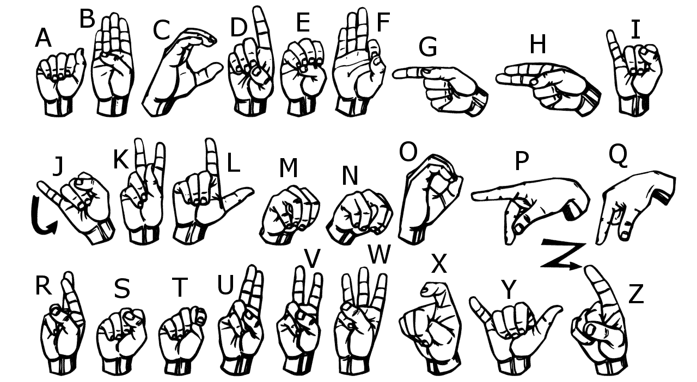
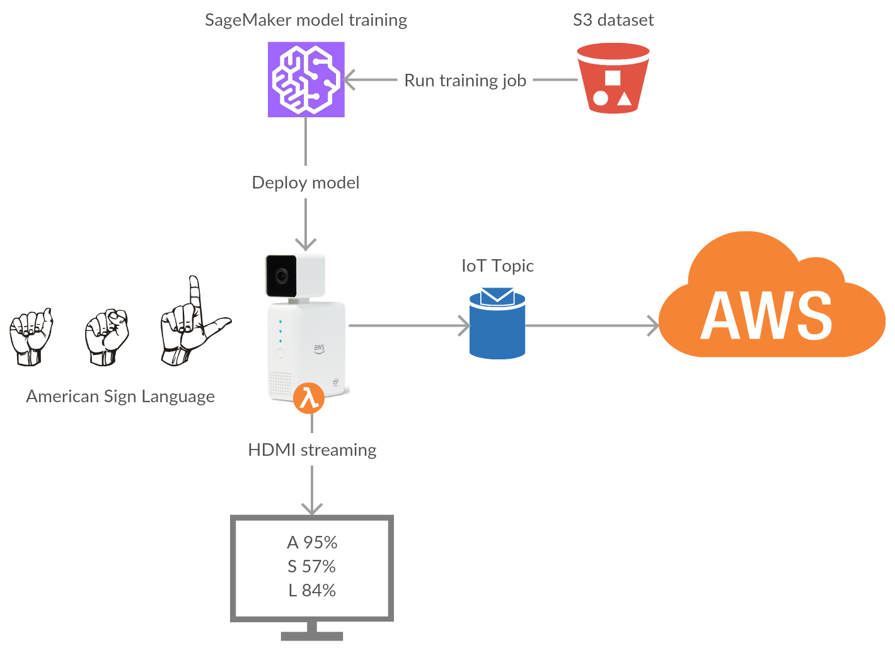
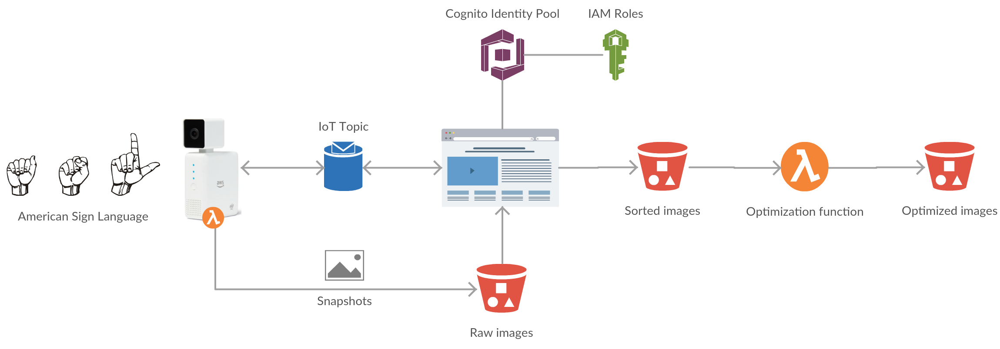

# AWS DeepLens Challenge

The future is not in keyboards and mice. Everyone agrees on the fact that interaction with computers will mainly use voice in the coming years. Siri, Cortana, Google Home, and, of course, Alexa (and Alexa for Business) are all examples of what the future may be. Even Werner Vogels thinks voice interaction will be the new traditional interaction (Nov’ 2017).

However, if nearly everybody can speak to a computer, removing the need for literacy (mandatory with a keyboard), some people in the society are still put apart: those who can’t speak. Whether they are deaf-and-dumb, or they don’t know the right languages (e.g. Foreigners or immigrates), they cannot interact with conversational agents.

The Deeplens may help them understand those who can’t speak, thanks to the American Sign Language (or some variants). The processing of video flow and a deep learning model can leverage the Deeplens as a new interface for them, translating ASL to written / spoken English in real time, so as to interact with computers.

Our participation at the AWS DeepLens Challenge shows it is possible by understanding the ASL alphabet. We have chosen the alphabet because it is mainly composed of static hands positions.
Our model is homemade, based on a Sagemaker vision model, fine trained on a specific dataset we have made during the challenge. We have removed ‘j’ and ‘z’ letters, as they require movement, and added special signs, up to you to find them ;)

## Demo video

Video available on [Youtube](https://www.youtube.com/watch?v=5VAKcQtoELo)

## How to use it

### Deployment

The model is located in the *model* folder and the Lambda function handler is located in the *lambda* folder. To use it, you just have to follow the same steps as described in the [AWS documentation](https://docs.aws.amazon.com/deeplens/latest/dg/deeplens-train-model.html) starting step 4.

Once deployed on the DeepLens, you will have to open the Project Stream to see the inference results and try to create sentences!

### Interface

The actual detected letter is shown in the top left corner (letter and confidence). If there is nothing displayed, it means that no letter was recognized with more than 40% confidence.

On the bottom of the image you can see your message as it is written. Each letter appears if the same letter is recognized during a sufficient time.

To make a whitespace: wait a few seconds with nothing recognized.
To reset the message: wait longer ;)

Be careful:
* Results are better if the background is white-ish, and there is nothing in the DeepLens field of view.
* Try to do the signs only in the field (no face / body / ...).
* There is a small delay between your movement and the camera feedback.

Here is the ASL alphabet that you can use:

## How we made it

The dataset was made with a specific Lambda function that runs on the DeepLens (see "Snapshot sub-project" below for more information).

We have taken different pictures with different people for each letter of the alphabet (except 'j' and 'z') and the special signs.

The training was done using Amazon SageMaker, with transfer learning on a squeezenet with 18 layers. It converges in 4 epochs to a satisfaying result.

Find below the architecture schema:

## The Snapshot sub-project

This project consists in using the DeepLens to generate the dataset. The camera is responding to user clicking on a button to take a snapshot and classifying the image right away.

It uses a frontend hosted on S3, authenticating with Cognito and communicating with the DeepLens through IoT topics. Once images arrive in S3, they are automatically optimized for SageMaker training jobs.

Find below the architecture schema:

